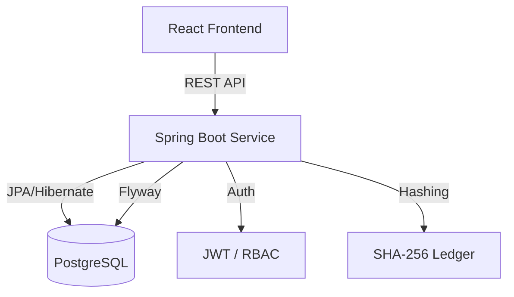

# 🛡️ ChainTrack
### *Smart Supply Chain Proof-of-Origin Platform*

[](https://github.com/redkiros81294/se4801-group-SY/actions)
[](#)
[](https://www.java.com)
[](https://spring.io/projects/spring-boot)
[](https://reactjs.org/)
[](LICENSE)

---

## 🌟 Overview

**ChainTrack** is an enterprise-grade solution designed to eliminate counterfeit goods and bring absolute transparency to global supply chains. By leveraging a **cryptographically signed, tamper-evident ledger**, ChainTrack ensures that every movement of a product—from the factory floor to the retail shelf—is verified and immutable.

### The Problem
Traditional supply chains often suffer from a lack of visibility, making it easy for counterfeit items to enter the market. Manual tracking is prone to error and manipulation.

### The Solution
ChainTrack records every hand-off as a transaction in a hash-chained ledger. A simple scan of a batch's **QR code** allows anyone to verify the entire journey of a product instantly. If a single record is altered, the entire chain breaks, and the product is flagged as **COMPROMISED**.

---

## ✨ Key Features

- **🔗 Immutable Hash-Chaining**: Every transaction contains a SHA-256 signature of the current event plus the hash of the previous event.
- **📸 In-Browser QR Scanning**: Verify products instantly using the browser's camera (via jsQR)—no app installation required.
- **🔐 Enterprise Security**: Role-Based Access Control (RBAC), JWT authentication, IP-based rate limiting, and standard security headers (HSTS, CSP).
- **📊 Real-time Analytics**: Admin dashboards provide system-wide insights into organizations, products, and supply chain health.
- **🏗️ Robust API**: Fully documented RESTful API using SpringDoc OpenAPI (Swagger UI).
- **🚀 Production Ready**: Containerized with Docker, optimized for non-root execution, and configured for seamless deployment on Render.

---

## 🎭 User Roles

| Role | Responsibilities |
| :--- | :--- |
| **ADMIN** | System management, organization onboarding, and global analytics. |
| **MANUFACTURER** | Product definition, batch creation, and initial "MANUFACTURED" event logging. |
| **SHIPPER** | Logging "SHIPPED" and "IN_TRANSIT" events during the logistics phase. |
| **RETAILER** | Final "RECEIVED" event logging and authenticity verification at the point of sale. |

---

## 🛠️ Tech Stack

### Backend
- **Core**: Java 21, Spring Boot 3.4
- **Database**: PostgreSQL 15 with **Flyway** migrations
- **Security**: Spring Security 6, JJWT (Stateless), Bucket4j (Rate Limiting)
- **API Docs**: SpringDoc OpenAPI 2.8
- **Testing**: JUnit 5, Mockito, Testcontainers

### Frontend
- **Framework**: React 19 (Vite)
- **Styling**: Tailwind CSS
- **Visualization**: Recharts
- **Utilities**: jsQR for camera-based scanning

---

## 🏗️ Architecture



---

## 🚀 Getting Started

### Prerequisites
- **JDK 21**
- **Maven 3.9+**
- **Node.js 18+**
- **Docker & Docker Compose**

### Quick Start (Docker)
The fastest way to get the entire stack running locally:
```bash
docker-compose up --build
```
- Backend: `http://localhost:8080`
- Frontend: `http://localhost:5173`

### Manual Backend Setup
```bash
mvn clean install
mvn spring-boot:run
```

### Manual Frontend Setup
```bash
cd frontend
npm install
npm run dev
```

---

## 🧪 Quality & Standards

ChainTrack is built with high standards of software engineering:
- **75%+ Test Coverage** across core logic and integration flows.
- **RFC 7807** compliant error responses.
- **CI/CD Pipeline** automated via GitHub Actions.
- **Non-root container execution** for enhanced security.

---

## 👥 Contributors
- **Yared Kiros** - *Full Stack Engineer*
- **Simon Mesfin** - *Full Stack Engineer*

---

## 📄 License
This project is licensed under the MIT License - see the [LICENSE](LICENSE) file for details.
