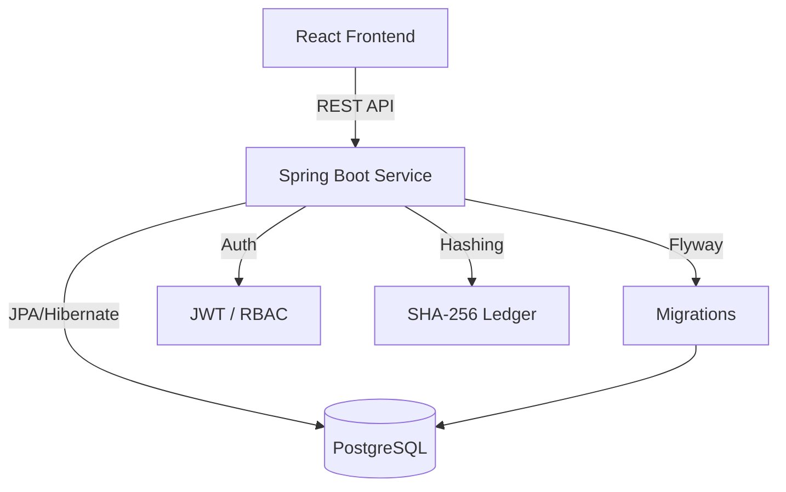

# 🛡️ ChainTrack
### *Smart Supply Chain Proof-of-Origin Platform*

[](https://github.com/redkiros81294/se4801-group-SY/actions)
[](#)
[](https://www.java.com)
[](https://spring.io/projects/spring-boot)
[](https://reactjs.org/)

---

## 🌟 Overview

ChainTrack solves the problem of counterfeit goods and lack of transparency in supply chains. Every time a product moves from manufacturer to shipper to retailer, ChainTrack records that movement as a cryptographically signed transaction. Anyone can scan a product's QR code and see the full verified journey of that product from factory to shelf.

The unique feature is a **hash-chained ledger** - each movement transaction stores a SHA-256 hash that includes the previous transaction's hash, making the chain tamper-evident. If anyone modifies a transaction in the database, the entire chain verification fails and the batch is flagged as **COMPROMISED**.

---

## 👥 Team Members

- **Yared Kiros** (Backend & Frontend)
- **Simon Mesfin** (Backend & Frontend)

---

## 🛠️ Tech Stack

- **Backend**: Java 21, Spring Boot 3.x, Maven
- **Database**: PostgreSQL 15, Spring Data JPA, Flyway migrations
- **Security**: Spring Security 6, JJWT 0.12.6 (stateless JWT), Bucket4j (Rate Limiting)
- **QR Codes**: ZXing 3.5.3
- **API Docs**: SpringDoc OpenAPI 2.8.4 (Swagger UI)
- **Testing**: JUnit 5, Mockito, Testcontainers, JaCoCo
- **Deployment**: Docker + Docker Compose (Render free tier)
- **Frontend**: React 19, Vite 8, Tailwind CSS, Recharts, jsQR (camera QR scan)

Base package: `com.chaintrack`

---

## ✨ Key Features & Standards

- **🔗 Immutable Hash-Chaining**: Cryptographically linked transaction history.
- **📸 In-Browser QR Scanning**: Instant verification via browser camera (jsQR).
- **🔐 Enterprise Security**: RBAC, JWT, Rate Limiting, and HSTS/CSP headers.
- **📊 Real-time Analytics**: Comprehensive dashboards for system-wide health.
- **🏗️ Robust API**: Fully documented with OpenAPI/Swagger.
- **🚀 Production Ready**: Optimized multi-stage Docker build, non-root execution.

---

## 🎭 User Roles

- **ADMIN**: Manages all users and organizations, views system-wide analytics, accesses everything.
- **MANUFACTURER**: Creates products and batches, generates QR codes for each batch, logs the first supply chain event (MANUFACTURED).
- **SHIPPER**: Logs movement events (SHIPPED, IN_TRANSIT), views assigned shipments, read-only on products.
- **RETAILER**: Logs the final event (RECEIVED), scans QR codes to verify authenticity, views received inventory.

---

## 🏛️ Domain Entities

- **Organization**: Represents a company in the supply chain (MANUFACTURER, SHIPPER, or RETAILER). Every user belongs to one organization.
- **User**: A person who logs into the system. Has one role and belongs to one organization. Password is BCrypt(12) hashed.
- **Product**: A type of item being tracked. Created by a MANUFACTURER. Has a unique SKU.
- **Batch**: A specific production run. Unique batch number format: `{SKU}-{yyyyMMdd}-{UUID first 8 chars}`. Statuses: `CREATED`, `IN_TRANSIT`, `DELIVERED`, or `COMPROMISED`.
- **MovementTransaction**: Records one supply chain event. Event types: `MANUFACTURED` → `SHIPPED` → `IN_TRANSIT` → `RECEIVED`. Stores a SHA-256 `signatureHash` computed from: `eventType` + `timestamp` + `fromOrgId` + `toOrgId` + `previousHash`.
- **QRToken**: One QR code per batch, generated using ZXing. Stores the Base64-encoded PNG image and a unique UUID token value.

---

## 🛤️ REST Endpoints

### Authentication (public)
- `POST /api/auth/register` - Create account
- `POST /api/auth/login` - Returns JWT token
- `POST /api/auth/logout` - Blacklists the token

### Organizations (ADMIN only)
- `GET /api/organizations` - Paginated list
- `POST /api/organizations` - Create organization

### Products (public read, MANUFACTURER write)
- `GET /api/products` - Paginated list (public)
- `POST /api/products` - Create product (MANUFACTURER)
- `GET /api/products/{id}` - Get by id (public)
- `PATCH /api/products/{id}` - Update (MANUFACTURER, own only)
- `GET /api/products/search` - Multi-parameter search (public)

### Batches (authenticated)
- `POST /api/batches` - Create batch (MANUFACTURER)
- `GET /api/batches/{id}` - Get batch details (all roles)
- `POST /api/batches/{id}/qr` - Generate QR code (MANUFACTURER)

### Transactions (authenticated)
- `POST /api/transactions` - Log a supply chain event
- `GET /api/transactions/batch/{batchId}` - Full history (all roles, paginated)

### Verify (fully public - the QR scan endpoint)
- `GET /api/verify/{token}` - Returns full provenance chain, re-validates all hashes on every call

### Admin (ADMIN only)
- `GET /api/admin/users` - Paginated user list
- `GET /api/admin/analytics` - System-wide statistics

---

## 📸 The Unique UI Feature

The React frontend has a `/scan` page that uses the browser's camera (via jsQR library) to scan a printed QR code on a product. On successful decode, it calls `GET /api/verify/{token}` and displays the full provenance timeline—green if the chain is valid, red with a COMPROMISED warning if any hash has been tampered with.

This works on mobile Chrome and Safari with no app install required. JWT is stored in React state only (never localStorage). The API base URL comes from the `VITE_API_URL` environment variable.

---

## 🏗️ Architecture



---

## 📂 Project Structure

```text
se4801-group-SY/
├── src/
│   ├── main/
│   │   ├── java/com/chaintrack/
│   │   │   ├── config/         (Security, CORS, Rate limiting)
│   │   │   ├── controller/     (REST Controllers)
│   │   │   ├── service/        (Business logic & Mappers)
│   │   │   ├── repository/     (Spring Data JPA Repositories)
│   │   │   ├── model/          (JPA Entities & Enums)
│   │   │   ├── dto/            (Request/Response DTOs)
│   │   │   ├── exception/      (Global error handling - RFC 7807)
│   │   │   └── security/       (JWT filters, Auth logic)
│   │   └── resources/
│   │       ├── db/migration/  (Flyway SQL scripts)
│   │       ├── application.properties
│   │       └── application-prod.properties
│   └── test/                  (JUnit 5, Integration tests)
├── frontend/                  (React 19 + Vite + Tailwind)
├── Dockerfile                 (Multi-stage build)
├── docker-compose.yml         (Local orchestration)
└── pom.xml                    (Maven configuration)
```

---

## 🚀 Getting Started

### Prerequisites
- **JDK 21**
- **Maven 3.x**
- **Node.js 18+**
- **Docker & Docker Compose**

### Quick Start (Docker)
```bash
docker-compose up --build
```
- Backend: `http://localhost:8080`
- Frontend: `http://localhost:5173`

### Manual Backend Setup
1. Clone the repository and navigate to root.
2. Run `mvn clean install`.
3. Start the server: `mvn spring-boot:run`.

### Manual Frontend Setup
1. Navigate to the `frontend` directory.
2. Copy `.env.example` to `.env` and update `VITE_API_URL`.
3. Run `npm install` and `npm run dev`.

---

## 🧪 Quality & Test Coverage

[](#)

Run `mvn test` for backend tests. Generate reports with `mvn jacoco:report` (available at `target/site/jacoco/index.html`).

---

## 🌐 Environment Variables

### Backend
- `SPRING_DATASOURCE_URL`: JDBC connection string
- `JWT_SECRET`: Secret key for token signing (min 32 chars)
- `FRONTEND_URL`: CORS allowed origin

### Frontend
- `VITE_API_URL`: Base URL for the backend API


