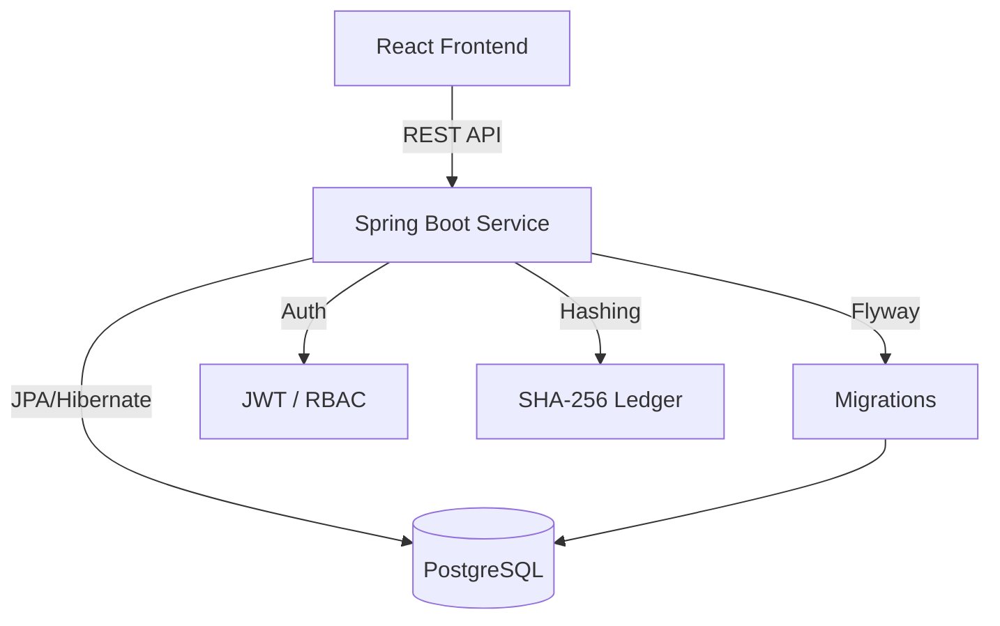

# 🛡️ ChainTrack
### *Smart Supply Chain Proof-of-Origin Platform*

[](https://github.com/redkiros81294/se4801-group-SY/actions)
[](#)
[](https://www.java.com)
[](https://spring.io/projects/spring-boot)
[](https://reactjs.org/)
[](LICENSE)

---

## 🌟 Overview

ChainTrack solves the problem of counterfeit goods and lack of transparency in supply chains. Every time a product moves from manufacturer to shipper to retailer, ChainTrack records that movement as a cryptographically signed transaction. Anyone can scan a product's QR code and see the full verified journey of that product from factory to shelf.

The unique feature is a hash-chained ledger - each movement transaction stores a SHA-256 hash that includes the previous transaction's hash, making the chain tamper-evident. If anyone modifies a transaction in the database, the entire chain verification fails and the batch is flagged as COMPROMISED.

---

## ✨ Key Features

- **🔗 Immutable Hash-Chaining**: Every transaction contains a SHA-256 signature of the current event plus the hash of the previous event.
- **📸 In-Browser QR Scanning**: Verify products instantly using the browser's camera (via jsQR)—no app installation required.
- **🔐 Enterprise Security**: Role-Based Access Control (RBAC), JWT authentication, IP-based rate limiting, and standard security headers (HSTS, CSP).
- **📊 Real-time Analytics**: Admin dashboards provide system-wide insights into organizations, products, and supply chain health.
- **🏗️ Robust API**: Fully documented RESTful API using SpringDoc OpenAPI (Swagger UI).
- **🚀 Production Ready**: Containerized with Docker, optimized for non-root execution, and configured for seamless deployment on Render.

---

## 👥 Team Members

- **Yared Kiros** (Backend & Frontend)
- **Simon Mesfin** (Backend & Frontend)

---

## 🛠️ Tech Stack

- **Backend**: Java 21, Spring Boot 3.x, Maven
- **Database**: PostgreSQL 15, Spring Data JPA, Flyway migrations
- **Security**: Spring Security 6, JJWT 0.12.6 (stateless JWT), Bucket4j (Rate Limiting)
- **QR Codes**: ZXing 3.5.3
- **API Docs**: SpringDoc OpenAPI 2.8.4 (Swagger UI)
- **Testing**: JUnit 5, Mockito, Testcontainers, JaCoCo
- **Deployment**: Docker + Docker Compose (Render free tier)
- **Frontend**: React 19, Vite 8, Tailwind CSS, Recharts, jsQR (camera QR scan)

Base package: `com.chaintrack`

---

## 🎭 User Roles

- **ADMIN**: Manages all users and organizations, views system-wide analytics, accesses everything
- **MANUFACTURER**: Creates products and batches, generates QR codes for each batch, logs the first supply chain event (MANUFACTURED)
- **SHIPPER**: Logs movement events (SHIPPED, IN_TRANSIT), views assigned shipments, read-only on products
- **RETAILER**: Logs the final event (RECEIVED), scans QR codes to verify authenticity, views received inventory

---

## 🏛️ Domain Entities

- **Organization**: Represents a company in the supply chain. Can be of type MANUFACTURER, SHIPPER, or RETAILER. Every user belongs to one organization.
- **User**: A person who logs into the system. Has one role and belongs to one organization. Password is always BCrypt(12) hashed.
- **Product**: A type of item being tracked (e.g. "Paracetamol 500mg"). Created by a MANUFACTURER. Has a unique SKU. One product can have many batches.
- **Batch**: A specific production run of a product (e.g. 500 units manufactured on a specific date). Has a unique batch number in the format {SKU}-{yyyyMMdd}-{UUID first 8 chars}. Has a status: CREATED, IN_TRANSIT, DELIVERED, or COMPROMISED. One batch has exactly one QR token.
- **MovementTransaction**: Records one supply chain event for a batch. Event types are: MANUFACTURED → SHIPPED → IN_TRANSIT → RECEIVED. Each transaction stores a SHA-256 signatureHash computed from: eventType + timestamp + fromOrgId + toOrgId + previousHash. The previousHash is the signatureHash of the previous transaction (or "GENESIS" for the very first event). This chain is immutable transactions are never updated or deleted.
- **QRToken**: One QR code per batch, generated using ZXing. Stores the Base64-encoded PNG image and a unique UUID token value. The public verify endpoint uses this token to look up the batch and return its full provenance chain.

---

## 🛤️ REST Endpoints

### Authentication (public):
- `POST /api/auth/register` - create account
- `POST /api/auth/login` - returns JWT token
- `POST /api/auth/logout` - blacklists the token

### Organizations (ADMIN only):
- `GET /api/organizations` - paginated list
- `POST /api/organizations` - create organization

### Products (public read, MANUFACTURER write):
- `GET /api/products` - paginated list (public)
- `POST /api/products` - create product (MANUFACTURER)
- `GET /api/products/{id}` - get by id (public)
- `PATCH /api/products/{id}` - update (MANUFACTURER, own only)
- `GET /api/products/search` - search by name, category, sku, fromDate (public, multi-param)

### Batches (authenticated):
- `POST /api/batches` - create batch (MANUFACTURER)
- `GET /api/batches/{id}` - get batch details (all roles)
- `POST /api/batches/{id}/qr` - generate QR code (MANUFACTURER)

### Transactions (authenticated):
- `POST /api/transactions` - log a supply chain event
- `GET /api/transactions/batch/{batchId}` - full history (all roles, paginated)

### Verify (fully public - the QR scan endpoint):
- `GET /api/verify/{token}` - returns full provenance chain, re-validates all hashes on every call

### Admin (ADMIN only):
- `GET /api/admin/users` - paginated user list
- `GET /api/admin/analytics` - system-wide statistics

---

## 📸 The Unique UI Feature

The React frontend has a /scan page that uses the browser's camera (via jsQR library) to scan a printed QR code on a product. On successful decode it calls `GET /api/verify/{token}` and displays the full provenance timeline green if the chain is valid, red with a COMPROMISED warning if any hash has been tampered with.

This works on mobile Chrome and Safari with no app install required. JWT is stored in React state only (never localStorage). The API base URL comes from the `VITE_API_URL` environment variable.

---

## 🏗️ Architecture



---

## 🚀 Getting Started

### Prerequisites
- **JDK 21**
- **Maven 3.x**
- **Node.js 18+**
- **Docker & Docker Compose**

### Quick Start (Docker)
The fastest way to get the entire stack running locally:
```bash
docker-compose up --build
```
- Backend: `http://localhost:8080`
- Frontend: `http://localhost:5173`

### Manual Backend Setup
1. Clone the repository.
2. Run `mvn clean install` to build.
3. Run `mvn spring-boot:run` to start on port 8080.

### Manual Frontend Setup
1. Navigate to the `frontend` directory.
2. Run `npm install` to install dependencies.
3. Run `npm run dev` to start.

---

## 🧪 Quality & Standards

ChainTrack is built with high standards of software engineering:
- **75%+ Test Coverage** across core logic and integration flows.
- **RFC 7807** compliant error responses.
- **CI/CD Pipeline** automated via GitHub Actions.
- **Non-root container execution** for enhanced security.

---

## 👥 Contributors
- **Yared Kiros** - *Full Stack Engineer*
- **Simon Mesfin** - *Full Stack Engineer*

---

## 📄 License
This project is licensed under the MIT License.
