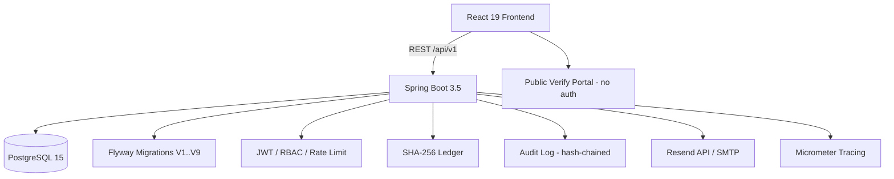

# 🛡️ ChainTrack
### *Tamper-Evident Supply Chain Provenance Platform*

[](https://github.com/redkiros81294/se4801-group-SY/actions)
[](https://www.java.com)
[](https://spring.io/projects/spring-boot)
[](https://reactjs.org/)

---

## 🌟 What ChainTrack Is

**ChainTrack is a B2B SaaS platform that proves where a product came from — and that nobody tampered with it along the way.**

Counterfeit goods cost the global economy **$500B+/year**, and recall response times (3+ days in most companies) cost lives and revenue. ChainTrack gives manufacturers, shippers, and retailers a single tamper-evident ledger:

1. **Manufacturer** registers a product and batch, and mints a QR code.
2. Every movement (manufactured → shipped → in-transit → received) is recorded as a **SHA-256 hash-chained transaction** — each hash includes the previous one.
3. **Anyone** — consumer, regulator, buyer — scans the QR and sees the full verified journey. If any record was altered, the chain breaks and the batch is flagged **COMPROMISED**.

This is the same architecture class used by pharma serialization (DSCSA) and food traceability (FSMA 204) — delivered as an API-first SaaS product with role-based multi-org access.

> 🎯 **For investors/buyers:** see [`docs/PITCH.md`](docs/PITCH.md) for the one-pager, market, and roadmap. Full threat model & compliance posture in [`docs/SECURITY.md`](docs/SECURITY.md).

---

## ✨ Enterprise Features

| Capability | Detail |
|---|---|
| 🔗 **Tamper-evident ledger** | SHA-256 hash chain over every movement; re-verified on every QR scan |
| 📸 **Public verification portal** | `/verify` — no login needed; consumers can verify any product QR (network-effect distribution) |
| 🔐 **RBAC + multi-org** | ADMIN / MANUFACTURER / SHIPPER / RETAILER, org-scoped data access (BOLA-protected) |
| 🛡️ **Immutable audit log** | Every CRUD action hash-chained + admin-verifiable (`GET /api/admin/audit/verify`) |
| 🔑 **Enterprise auth** | JWT (blacklist-enabled logout), rate limiting, change-password, admin-provisioned accounts |
| 📊 **Real-time dashboards** | Live supply-chain analytics for admin + manufacturer |
| 🔍 **Structured logging** | Trace/span/correlation IDs on every log line (Micrometer Tracing + `X-Request-Id`) |
| ✉️ **Email delivery** | Resend API (branded HTML invites) with automatic SMTP fallback |
| 📘 **OpenAPI docs** | Swagger UI at `/swagger-ui.html` |

---

## 🏛️ Architecture (high level)


```mermaid
graph TD
    A[React 19 Frontend] -->|REST /api/v1| B[Spring Boot 3.5]
    B --> C[(PostgreSQL 15)]
    B --> D[Flyway Migrations V1..V9]
    B --> E[JWT / RBAC / Rate Limit]
    B --> F[SHA-256 Ledger]
    B --> G[Audit Log - hash-chained]
    B --> H[Resend API / SMTP]
    B --> I[Micrometer Tracing]
    A --> J[Public Verify Portal - no auth]
```

Full detail: [`docs/ARCHITECTURE.md`](docs/ARCHITECTURE.md) · [`docs/SECURITY.md`](docs/SECURITY.md)

---

## 👥 Team

- **Yared Kiros** — Backend & Frontend
- **Simon Mesfin** — Backend & Frontend

---

## 🛠️ Tech Stack

- **Backend**: Java 21, Spring Boot 3.5, Maven, Spring Data JPA, Spring Security 6
- **Database**: PostgreSQL 15, Flyway migrations, Hibernate (UTC, `ddl-auto=none`)
- **Security**: JJWT 0.12.6 (stateless JWT + blacklist), Bucket4j rate limiting, HSTS/CSP, BOLA checks
- **Integrity**: SHA-256 hash-chained movement ledger + hash-chained audit log
- **Observability**: Spring Boot Actuator, Micrometer Tracing (Brave), correlation IDs
- **Email**: Resend REST API (fallback: SMTP)
- **QR**: ZXing (generate) + jsQR (browser scan)
- **API Docs**: SpringDoc OpenAPI 2.8.4 (Swagger UI)
- **Testing**: JUnit 5, Mockito, Testcontainers, JaCoCo (coverage ~75%)
- **Frontend**: React 19, Vite, Tailwind CSS, Recharts, React Router (lazy code-split)
- **CI/CD**: GitHub Actions (backend CI + frontend deploy), Docker multi-stage

---

## 🎭 User Roles

- **ADMIN** — manages users/orgs, views analytics, reads the immutable audit log.
- **MANUFACTURER** — creates products/batches, mints QR codes, logs MANUFACTURED.
- **SHIPPER** — logs SHIPPED / IN_TRANSIT.
- **RETAILER** — logs RECEIVED, verifies authenticity at the shelf.

---

## 🔑 Demo Credentials (seeded)

| Role | Email | Password |
|---|---|---|
| Admin | `admin@chaintrack.com` | `Admin@123!` |
| Instructor (Admin) | `instructor@chaintrack.com` | `Instructor@123` |
| Manufacturer | `manufacturer@pharmacorp.com` | `Manufacturer@123` |
| Shipper | `shipper@globallogistics.com` | `Shipper@123` |
| Retailer | `retailer@mediretail.com` | `Retailer@123` |

**Public demo QR token** (paste into `/verify`): `aaaaaaaa-aaaa-aaaa-aaaa-aaaaaaaaaaaa` → verifies **VALID**. The seeded batch `BATCH-BPM-2024-004` is deliberately tampered to demo **COMPROMISED** detection.

---

## 🛤️ REST API (summary)

- `POST /api/auth/login` · `POST /api/auth/logout` · `POST /api/auth/change-password`
- `POST /api/auth/invite` · `POST /api/auth/invitations/accept` · `GET /api/auth/invitations/{token}`
- `GET/POST /api/organizations` (ADMIN)
- `GET/POST /api/products` · `GET/PATCH /api/products/{id}` · `GET /api/products/search`
- `POST /api/batches` · `GET /api/batches` · `GET /api/batches/{id}` · `POST /api/batches/{id}/qr`
- `POST /api/transactions` · `GET /api/transactions/batch/{batchId}`
- `GET /api/verify/{token}` — **public** provenance verification
- `GET/POST /api/admin/users` · `POST /api/admin/users/{id}/approve|reject`
- `GET /api/admin/audit` · `GET /api/admin/audit/verify` — immutable audit log
- `GET /api/admin/analytics` · `POST /api/admin/demo/reset` — restore the demo dataset before a pitch
- `GET /health` · `GET /actuator/health`

---

## 🚀 Getting Started

### Docker (easiest)
```bash
docker-compose up --build
```
- Backend: `http://localhost:8080` · Swagger: `http://localhost:8080/swagger-ui.html`
- Frontend: `http://localhost:5173`

### Manual
```bash
# backend
mvn clean install && mvn spring-boot:run
# frontend
cd frontend && npm install && npm run dev
```

---

## 🌐 Environment Variables

**Backend**
| Var | Purpose | Required |
|---|---|---|
| `DB_URL`, `DB_USERNAME`, `DB_PASSWORD` | PostgreSQL connection | dev defaults provided |
| `JWT_SECRET` | JWT signing key (**min 32 chars**; prod **fails fast** if missing) | prod yes |
| `FRONTEND_URL` | CORS origin + invite links | dev default |
| `RESEND_API_KEY` | Enterprise email (falls back to SMTP) | no |
| `MAIL_HOST/PORT/USERNAME/PASSWORD` | SMTP fallback | no |
| `EMAIL_PROVIDER` | `auto` (default) / `resend` / `smtp` | no |
| `TRACING_SAMPLING_PROBABILITY` | Trace sampling (default `1.0`) | no |

**Frontend**
| Var | Purpose |
|---|---|
| `VITE_API_URL` | Backend base URL (falls back to hosted API) |
| `VITE_API_FALLBACK_URL` | Secondary backend URL |

---

## 🧪 Quality

- `mvn test` — backend unit + integration tests (JaCoCo report: `target/site/jacoco/index.html`)
- `cd frontend && npx vitest run` — component tests (jsdom)
- `cd frontend && npx tsc -b --noEmit` — TypeScript check

---

## 📄 Documentation

- [`docs/PITCH.md`](docs/PITCH.md) — investor one-pager: problem, market, product, roadmap
- [`docs/ARCHITECTURE.md`](docs/ARCHITECTURE.md) — system design, data model, hash-chain math
- [`docs/SECURITY.md`](docs/SECURITY.md) — threat model, security controls, SOC 2 readiness
